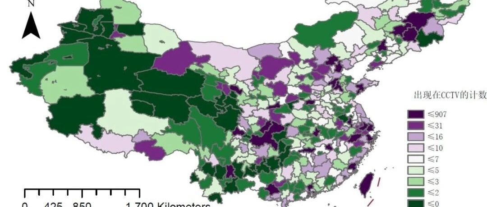
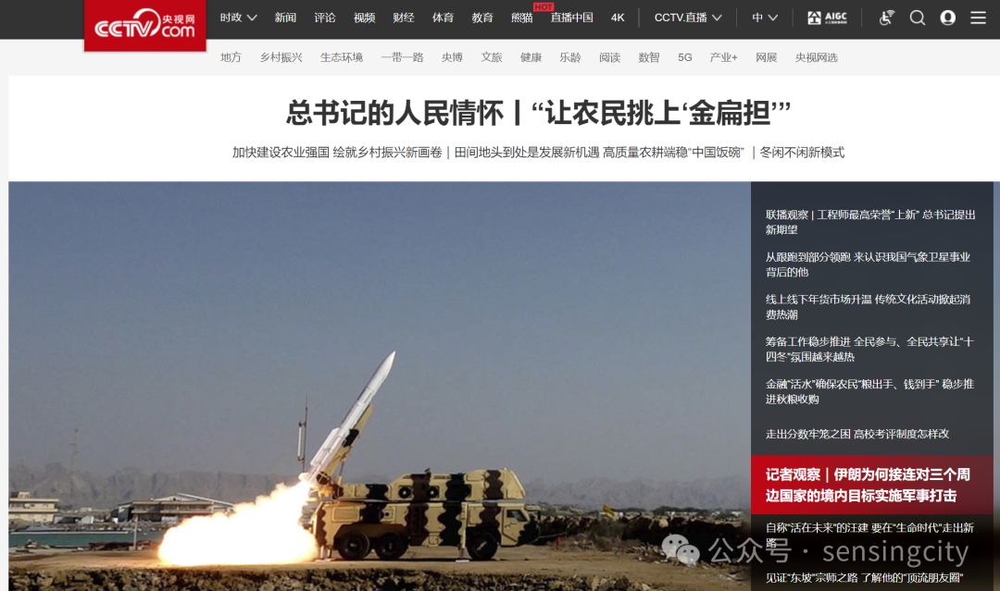
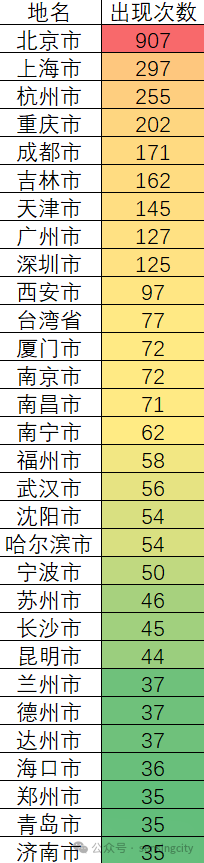
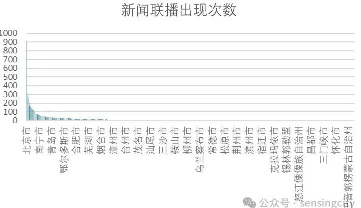
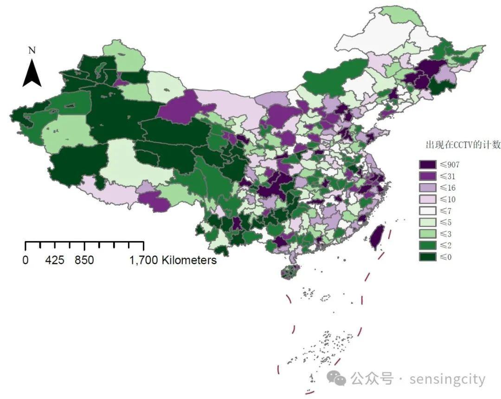

#  哪个城市是中央眼中的心头爱？基于新闻联播文本的大数据分析

原创  喵喵张  [ 城市感知计算 ](javascript:void\(0\);)

**城市感知计算**

微信号  sensingcity

功能介绍  认识世界和改造世界，分享地理信息系统科普知识与学术研究，欢迎加好友学术交流。

__ __

__ _ _ _ _

又到了年底数据大盘点的时刻，在过去的一年里，哪个城市在中央眼中获得了更多的关注呢？新闻联播作为国家意志的传声筒，无疑代表了相当程度上的国家关注。本次分析的数据来自于央视网，遍历其页面，检索获取了2023年至今的所有新闻联播文本。

共检索了384天的数据，约有9000条各类新闻播报。从这些语料中检索中国344个城市出现次数，以解释这些城市在国家政治、经济或社会方面的重要性。靠前出现的次数是北京、上海、杭州、重庆、成都、吉林（省市）、天津、广州、深圳、西安、台湾、厦门等等。而我国的经济前列的城市则是上海、北京、深圳、重庆、广州、苏州、成都、杭州、武汉、南京，如果建立在更长时间序列，来看城市在新闻联播中的关注度移动，相信也是一个很有趣的话题。

把这些城市可视化出来~除了长三角城市外，好像北方的城市更容易被提及诶。除了西部三省外，云贵地区的声量也较弱，长江中游的十余个城市除了武汉南昌长沙外，其余城市也基本上属于“小透明”。

附送本文所使用的数据抓取代码，如果有时间可以绘制近10年来的城市关注度转移情况，相信也会是很有意思的事情，有空剪辑一个视频出来hhh  。

  *   *   *   *   *   *   *   *   *   *   *   *   *   *   *   *   *   *   *   *   *   *   *   *   *   *   *   *   *   *   *   *   *   *   *   *   *   *   *   *   *   *   *   *   *   *   *   *   *   *   *   *   *   * 

    
    
    import requestsimport pandas as pdfrom bs4 import BeautifulSoupfrom datetime import datetime, timedelta# Function to extract details from a video linkdef get_video_details(video_url):    res_video = requests.get(video_url)    res_video.encoding = 'utf-8'    soup_video = BeautifulSoup(res_video.text, 'html.parser')    title = soup_video.find('title').text    description = soup_video.find('meta', {'name': 'description'})['content']    source = soup_video.find('span', class_='laiyuan').text    time = soup_video.find('span', class_='time').text    content = soup_video.find('div', id='content_area').text.strip()    return f"标题: {title}\n描述: {description}\n来源: {source}\n时间: {time}\n内容: {content}"# Initialize DataFramedf = pd.DataFrame(columns=['Video Title', 'Video Link', 'Video Image', 'Video Duration'])# Specify the date rangestart_date = datetime.strptime('20230101', '%Y%m%d')end_date = datetime.today()  
    # Iterate over each day in the date rangewhile start_date <= end_date:    date_str = start_date.strftime('%Y%m%d')    url = f'https://tv.cctv.com/lm/xwlb/day/{date_str}.shtml'  
        # Fetch HTML content    res = requests.get(url)    res.encoding = 'utf-8'    html_code = res.text    soup = BeautifulSoup(html_code, 'html.parser')  
        # Extract information from each video entry    for li in soup.find_all('li'):        a_tag = li.find('a', {'alt': True})        if a_tag:            video_title = a_tag.get('alt')            video_link = li.find('a', {'href': True}).get('href')            video_image = li.find('img').get('src')            video_duration = li.find('span').text  
                # Append the extracted information to the DataFrame            df = df.append({'Video Title': video_title,                            'Video Link': video_link,                            'Video Image': video_image,                            'Video Duration': video_duration}, ignore_index=True)    # Print or use the DataFrame as needed    df['Details'] = df['Video Link'].apply(get_video_details)    # Save DataFrame to CSV    df.to_csv(f'videos_{date_str}.csv', index=False)    # Clear the DataFrame for the next iteration    df = pd.DataFrame(columns=['Video Title', 'Video Link', 'Video Image', 'Video Duration'])    # Move to the next day    start_date += timedelta(days=1)

  

预览时标签不可点

微信扫一扫  
关注该公众号

****

****

  收藏

